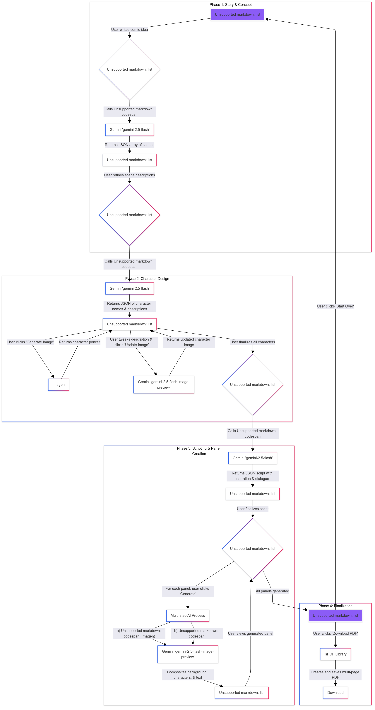

# Sonics.ai 📚🎬

#### *Comics & Scripts - Generator / Editor*

 

***Sonics.ai** generates **character consistent comic** sequence panels with a single prompt & empowers users to **edit scenes, characters, dialogues - independently, precisely** in natural language by leveraging the multi-modal, multi-image capabilities of the **Gemini 2.5 Flash Image model** (nano banana)*

*Users can create a storyline, design characters with AI, refine them, and finally generate the full comic strip - pdf, scripts."*

 

> 📝 [ A brief write-up detailing which Gemini 2.5 Flash Image (nano-banana) features were used and how they are central to the application.
](#a-brief-write-up-)
>
> 🗂️ [ Architecture Diagram](#architecture-diagram-%EF%B8%8F)
>
> 🚀 [ Run and Deploy](#run-and-deploy-)

 

> ▶️ <a href="https://youtu.be/gZ8NMynV-vA"> Watch Demo Video</a>
>
> 🎬 <a href="https://www.youtube.com/watch?v=5lH7KmiENYs"> Watch Comic Video</a>
>
>  📚 <a href="https://drive.google.com/file/d/1YEf60wesaHiawA1DJhbl1bR7pppOkPGn/view?usp=sharing"> View Comic pdf</a>

 

 

 

## A brief write-up 📝
***detailing which Gemini 2.5 Flash Image (nano-banana) features were used and how they are central to the application.***

 

The app's core feature is the ability to process a combination of multiple input images and a detailed text prompt and to make independent edits in scene, characters, dialogues in the comic.

 

 

### *Intelligent Panel Composition to ensure Character consistencies throughout the Comic*

 

> SONICS.ai leverages this ***unique capability of nano-banana model*** to ensure **CHARACTER CONSISTENICES** ***across all panels of the comic*** by ensuring **intelligent image composition** for panel creation **logic**.
>- The model input is a background & character images (that were validated by user).
>- ***The nano-bana model is then prompted to artfully compose these elements into a cohesive comic panel, following complex instructions regarding character poses, text dialogues.***

... And it clearly surpasses the expectations.

 

### *User validations and natural language tweaks*

 

>- Furthermore, the model's capacity for iterative image editing powers the "Update" and "Tweak" functionalities. 
>- Users can refine character designs **independently & precisely** or adjust entire panels using natural language, providing a fluid and intuitive creative workflow.
>- One of the most critical feature is **its sophisticated in-image rendering** .The application relies on the model to flawlessly render narration and dialogue within speech bubbles and caption boxes directly onto the panel, transforming disparate assets into a finished comic page. 

...these features are not just supplemental; they are the engine driving the creation of every visual element from character design to the final page.

 

 

 

## Architecture Diagram 🗂️

 

 

 

## Run and deploy 🚀

This contains everything you need to run the app locally.

##### Run Locally

**Prerequisites:**  Node.js

1. Install dependencies:
   `npm install`
2. Set the `GEMINI_API_KEY` in [.env.local](.env.local) to your Gemini API key
3. Run the app:
   `npm run dev`

 

 

 

***. . .  Bring your stories to life... build and tell stories dynamically  🖌️***
 
*' Customize ' & ' Optimize '* every step with *' Gemini nano banana '  - powered by Google AI studio.*

